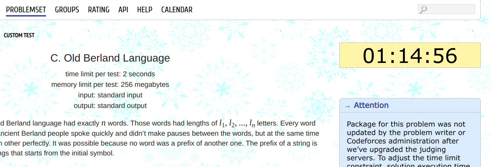
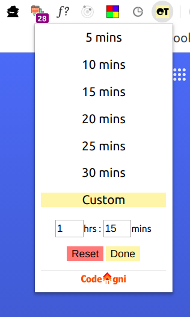

<h1> Codeforces Timer 
</h1>
A Google Chrome Extension to add a timer to practice speed problem solving on Codeforces.

 

## Preview

    
 

## Whats new ?

- Now you can set Custom Timer.

## Installation

1. Download the repo as `.zip` and extract it.
2. Open Google Chrome -> Settings -> Extensions -> Toggle On Developer Mode -> Load Unpacked Extensions -> Point to the extracted folder.

## Note

You may want to disable the extension before attempting an actual live contest, just to avoid confusion between individual problem timer and real contest timer. 
It can be disabled from Settings -> Extensions page.

## Usage

1. Select the timer as per your need from the drop down of extension icon.
2. Selected timer will be applied for all the problems that you open.
3. Problems can be opened from Problemset page and Contest page.
4. Once a problem is opened timer cannot be paused.
5. When a solution is submitted within time, and is accepted, the timer will detect and automatically stop and show `Finished`.
6. For already solved problems, timer will show a `Finished` message.
7. For problems, you ran out of time, it will show a `Timed Out` message.

## Development setup

1. Fork it and clone as local repository.
2. Follow installation, to start playing around.
3. Start developing !

